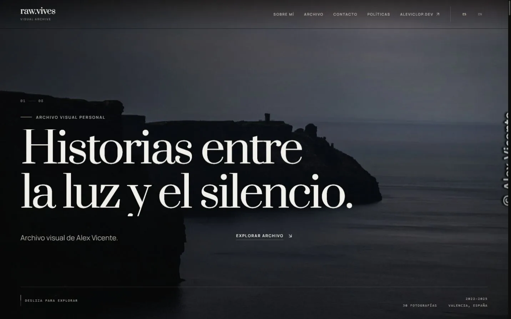
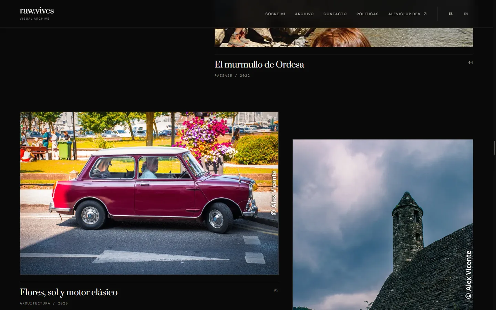
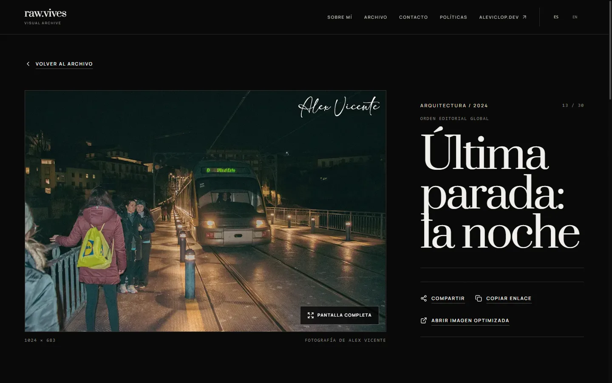

# raw.vives

Archivo visual bilingüe de Alex Vicente: una experiencia editorial para recorrer fotografía, memoria y territorio con una navegación rápida, accesible y preparada para distribución estática.



**Producción:** [gallery.aleviclop.dev](https://gallery.aleviclop.dev) · **Estado de este checkout:** preparado y validado localmente; el despliegue de esta versión es una acción manual pendiente.

## Objetivo

Transformar una galería personal en una pieza de portfolio con criterio editorial, rutas profundas compartibles y una base técnica mantenible. El proyecto conserva la fotografía como centro: la interfaz acompaña, no compite.

## Características

- Home narrativa con intro de sesión, hero, manifiesto, historias y capítulos visuales.
- Archivo de 30 fotografías con búsqueda, categorías, años, orden y carga progresiva.
- Detalles individuales con navegación contextual, fullscreen, compartir y obras relacionadas.
- Español e inglés generados de forma estática, con selector de idioma y SEO localizado.
- Cursor contextual, microinteracciones GSAP y WebGL progresivo solo cuando el dispositivo lo permite.
- Reduced motion, forced colors, teclado, foco visible, 404, fallbacks de imagen y sin JavaScript crítico para leer el contenido.
- Sitemap, robots, JSON-LD, Open Graph, manifest, iconos y headers de producción.

## Stack

Next.js 16 App Router, React 19, TypeScript estricto, Tailwind CSS 4, GSAP, Three.js, Vitest, Sharp, pnpm y Cloudflare Workers Static Assets.

## Arquitectura

El proyecto usa `output: "export"`: no depende de un servidor Next.js en ejecución. `app/` define rutas y metadata; `components/` contiene sistemas de interfaz; `lib/` concentra datos, SEO y reglas puras; `dictionaries/` resuelve la i18n manual; `scripts/` construye y valida la tubería fotográfica. Wrangler sirve el directorio `out/`.

Más detalle en [arquitectura](docs/RAW_VIVES_ARCHITECTURE.md), [sistema de archivo](docs/RAW_VIVES_ARCHIVE_SYSTEM.md) y [sistema de release](docs/RAW_VIVES_RELEASE_SYSTEM.md).

## Sistema visual

La dirección combina tipografía editorial, negro cálido, líneas finas, ritmo modular y fotografía a gran escala. El sistema evita cards genéricas y ornamento gratuito; cada transición sostiene jerarquía, contexto o continuidad.

## Motion, cursor y WebGL

GSAP coordina entradas, scroll y feedback con limpieza por ciclo de vida. El cursor contextual solo se activa con puntero fino y hover. El fondo WebGL es enriquecimiento progresivo: no carga con reduced motion, forced colors, dispositivos limitados o ausencia de soporte; el contenido y la imagen hero permanecen disponibles.

## Archivo y detalle

El estado del archivo se refleja en la URL para poder compartir búsquedas y filtros. Cada fotografía dispone de rutas `/es/photo/[id]` y `/en/photo/[id]`, metadata propia, imagen optimizada y navegación anterior/siguiente sin perder el contexto editorial.





## Proceso creativo

Las variantes públicas se generan desde `public/photos/raw/` mediante Sharp. El proceso crea WebP, AVIF, dimensiones, EXIF permitido y placeholders; después valida correspondencia y evita que las fuentes de proceso se copien al artefacto público. Los originales de cámara, catálogos y sidecars no pertenecen al repositorio.

## Accesibilidad

La interfaz incluye skip link, landmarks, HTML semántico, foco restaurado en menús y fullscreen, navegación por teclado, estados anunciados y alternativas para movimiento reducido y colores forzados. La accesibilidad se comprueba con tests y smoke tests de navegador; no se presenta como certificación formal.

## Rendimiento

Las imágenes usan variantes responsivas y carga diferida salvo contenido prioritario. Los chunks versionados reciben caché inmutable, el HTML se revalida y las fotografías tienen caché corta para permitir sustituciones editoriales. La build final validada ocupa aproximadamente 39,1 MiB y excluye `out/photos/raw/`.

## Internacionalización y SEO

`es` y `en` son las únicas locales admitidas. Canonicals, `hreflang`, sitemap, robots, Open Graph e `ImageObject` se generan con `NEXT_PUBLIC_BASE_URL`. La página de privacidad se marca `noindex, follow`; las 30 fotografías sí aparecen en ambos idiomas.

## Instalación

Requisitos: Node `22.22.2`, pnpm `10.34.1` y Git.

```powershell
corepack enable
pnpm install --frozen-lockfile
Copy-Item .env.example .env.local
pnpm dev
```

## Variables de entorno

```dotenv
NEXT_PUBLIC_BASE_URL=https://gallery.aleviclop.dev
NEXT_PUBLIC_WEB3FORMS_ACCESS_KEY=replace-with-your-public-access-key
```

Ambas se integran en la build estática y, por tanto, son públicas. La clave de Web3Forms es un identificador público del formulario, no un secreto de servidor. Se configura como secret del entorno GitHub para evitar almacenarla en el repositorio.

## Scripts

| Comando | Uso |
| --- | --- |
| `pnpm dev` | Desarrollo Next.js |
| `pnpm preview` | Preview del `out/` con Wrangler en `:8788` |
| `pnpm optimize-images` | Regenera variantes y metadata fotográfica |
| `pnpm check` | Typecheck, lint, tests y build |
| `pnpm typecheck` / `pnpm lint` | TypeScript estricto |
| `pnpm test` | Suite Vitest |
| `pnpm build` | Valida fotos, exporta y elimina fuentes del artefacto |
| `pnpm deploy:wrangler` | Build y despliegue manual a Cloudflare |

## Desarrollo, tests y build

Antes de entregar cambios:

```powershell
pnpm typecheck
pnpm lint
pnpm test
pnpm build
git diff --check
```

No existe una suite E2E automatizada; los recorridos críticos se validan además en navegador sobre `pnpm preview`.

## Despliegue

El workflow CI valida cada push y pull request a `main`. Producción solo se despliega mediante `workflow_dispatch`, usando el environment `production` y sus variables. El procedimiento, DNS, rollback y smoke tests están en [RAW_VIVES_DEPLOYMENT.md](docs/RAW_VIVES_DEPLOYMENT.md).

## Estructura

```text
app/                 rutas, metadata, sitemap, robots y manifest
components/          UI, archivo, motion, intro y detalle
dictionaries/        contenido ES/EN
lib/                 configuración, datos, SEO y utilidades
public/photos/        fuentes web y variantes optimizadas
scripts/             generación y controles del pipeline
tests/               tests unitarios y de producción
docs/                decisiones, auditorías y materiales de entrega
```

## Decisiones y limitaciones

- Export estático para reducir superficie operativa y servir desde CDN.
- Sin analítica ni cookies en esta release: no se recoge telemetría sin una finalidad acordada.
- Web3Forms es un tercero; su disponibilidad, tratamiento y controles anti-spam quedan fuera del runtime propio.
- CSP está definida en `_headers`; cualquier nuevo origen debe revisarse explícitamente.
- No hay comparator before/after ni vídeo generado: no se fabrican activos que el producto no ofrece.
- La validación en producción de esta release solo puede realizarse después de un despliegue autorizado.

## Roadmap realista

1. Ejecutar preview remoto y validación visual independiente.
2. Configurar environment de GitHub, desplegar manualmente y completar smoke tests reales.
3. Incorporar monitorización o analítica únicamente con objetivos, base legal y presupuesto de privacidad definidos.
4. Automatizar E2E sobre las rutas y controles críticos si crece la frecuencia de release.

## Documentación

Consulta el [caso de estudio](docs/RAW_VIVES_CASE_STUDY.md), la [auditoría de producción](docs/RAW_VIVES_PRODUCTION_AUDIT.md), el [checklist de release](docs/RAW_VIVES_RELEASE_CHECKLIST.md) y las [release notes](docs/RAW_VIVES_RELEASE_NOTES.md).

## Autor y derechos

Diseño, desarrollo y fotografía: **Alex Vicente**.

El código fuente no declara una licencia open source. Todas las fotografías, textos de marca y activos visuales están protegidos por derechos de autor; no pueden reutilizarse, entrenarse, redistribuirse ni explotarse comercialmente sin permiso expreso. Las dependencias conservan sus licencias propias.
